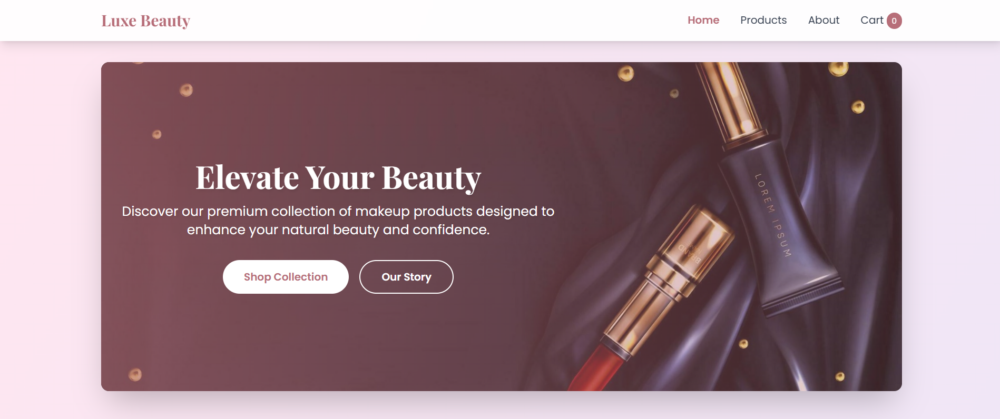

# 💄 Luxe Beauty — An AI Generated Makeup Store

Welcome to **Luxe Beauty**, a sleek and fully responsive e-commerce website designed for a modern beauty store. Crafted with ❤ using **HTML**, **Tailwind CSS**, and **JavaScript**, this project is part of my Web Technology Sessional coursework (CSE 434).
.

---

## 📸 Preview

  
Elegant banner, modern layout, and responsive design

---

## 🛠 Tech Stack

- *HTML5* – Structure
- *Tailwind CSS* – Styling and layout
- *JavaScript* – Dynamic interaction

---

## 🧩 Features

### 🏠 Home Page
- *Navbar* – Clean and sticky navigation
- *Hero Banner* – Stylish and eye-catching
- *Featured Categories* – Showcase popular makeup types
- *Best Sellers* – Dynamic product highlights
- *Beauty Tips* – Informative carousel/section
- *Customer Testimonials* – Real feedback design
- *Promotional Footer Banner*
- *Footer* – Quick links and social media

### 🛍 Products Page
- *Filter System* – Browse by categories
- *Product Cards* – Responsive, hover effects, and pricing

### ℹ About Page
- *Brand Story* – Learn about Luxe Beauty
- *Our Values* – What we stand for
- *Contact Section* – Basic info for reaching out

### 🛒 Cart System
- *Empty Cart UI*
- *Add to Cart Functionality*
- *Proceed to Checkout*
- *Order Summary Page*

### 📱 Mobile Responsive
- 100% Responsive across all devices using Tailwind's utility-first approach
